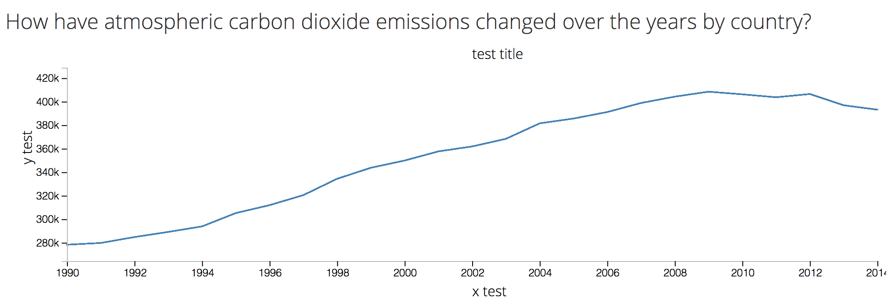

# a3-reusability

Building a Line Graph

This is exercise to make a reusable line graph.

main.js has completed code, emptymain.js is where to recreate main.js

## Initiation of chart
var chartWrapper = d3.select('#mydiv').datum([dataSet]).call(myChart); 

## Update a chart parameter and the data (on some event handler)
myChart.param1(newValue);
chartWrapper.datum([newDataSet]).call(myChart);

## Methods to change
.width(newValue)

.height(newValue)

.xTitle(newString)

.yTitle(newString)

.title(newString)

## Data structure
Example of csv file
```
"country_area","year","value"
"Australia","2014","393126.946994288"
"Australia","2013","396913.93653029"
"Australia","2012","406462.8477036"
"Australia","2011","403705.528313991"
"Australia","2010","406200.993184341"
"Australia","2009","408448.47899963"
"Australia","2008","404237.828214077"
```

## Graph example
